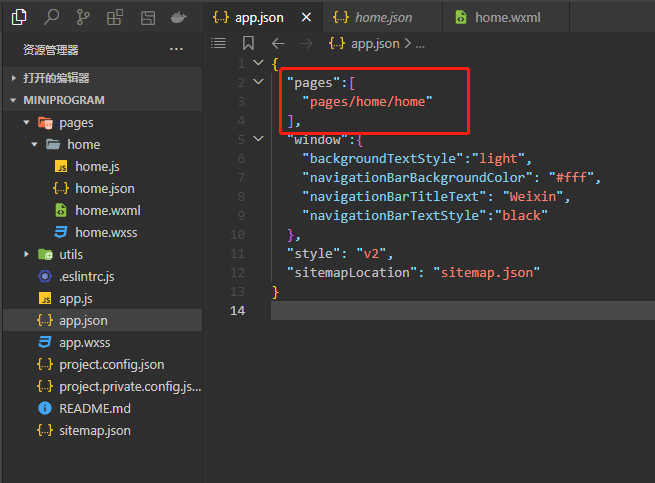

# 小程序开发

## 一、小程序开发流程

### 1.[微信公众平台](https://mp.weixin.qq.com/)注册并登录生成 AppID

### 2.下载[微信开发者工具](https://developers.weixin.qq.com/miniprogram/dev/devtools/download.html)

### 3.新建一个空文件夹，使用微信开发者工具新建一个小程序项目，使用生成的 AppID。这里只有管理员才可以上传代码，但是可以在[成员管理](https://mp.weixin.qq.com/wxamp/user/manage?action=index&use_role=1&token=311186451&lang=zh_CN)里添加项目开发人员

### 4.开发者可以使用微信开发者工具在真机上预览自己的小项目

## 二、项目结构

### 1.小程序所有的页面都是在 pages 文件夹下，app.json 是全局配置文件，在 app.json 的 pages 数组里直接写入路径，会自动在 pages 文件夹下生成每个页面对应的文件夹，每个子目录下有 js/json/wxml/wxss 四个文件



### 2.[sitemap.json](https://developers.weixin.qq.com/miniprogram/dev/reference/configuration/sitemap.html) 文件：用于配置小程序及其页面是否允许被微信索引(爬虫)

## 三、全局配置

### 1.在 app.json 中全局配置

### 2.window 的配置：导航栏，下拉刷新，loading 样式

### 3.底部 tabBar 的配置：lists，borderStyle，selectedColor，color，backgroundColor

### 4.每个页面的 json 文件可重新配置 app.json 中 window 的属性，达到覆盖的作用

## 四、数据绑定：双大括号

```html
<!-- 表达式 -->
<view>{{ 20 + 10 }}</view>
<!-- 三元表达式 -->
<view>{{ 20 > 10 ? 'aaa' : 'bbb' }}</view>
<!-- 变量 -->
<view>{{ value }}</view>
<!-- 属性同样支持变量 -->
<view class="my-{{ class[0] }}">aaa</view>
<view class="my-{{ class[1] }}">bbb</view>
<view class="my-{{ class[2] }}">ccc</view>
<!-- 列表渲染，默认item与index名 -->
<view wx:for="{{list}}" wx:key="index">
  {{index}}：{{item.name}}-{{item.age}}
</view>
<!-- 列表渲染，改变item与index名 -->
<view wx:for="{{list}}" wx:for-index="idx" wx:for-item="ele" wx:key="idx">
  {{idx}}：{{ele.name}}-{{ele.age}}
</view>
<!-- 条件渲染 -->
<!-- wx:if其实就是visibility:visible/hidden，元素会有局部渲染的过程，适用于运行条件不大可能改变的场景 -->
<view wx:if="{{isCreated}}"> 我是动态创建和删除的-if </view>
<view wx:else="{{isCreated}}"> 我是动态创建和删除的-else </view>
<!-- 也可用三元表达式表示 -->
<view class="{{isCreated ? 'show' :'hidden'}}"> 我是动态创建和删除的 </view>
<!-- hidden其实就是display:block/none，dom元素在，一开始就被渲染了，适用于频繁切换的场景 -->
<view hidden="{{isShow}}"> 我是动态隐藏和显示的 </view>
```

```json
 data: {
        value: '测试数据',
        class: ['aaa', 'bbb', 'ccc'],
        list: [{
            name: 'qiu1',
            age: 1,
        }, {
            name: 'qiu2',
            age: 18,
        }, {
            name: 'qiu3',
            age: 182,
        }, {
            name: 'qiu4',
            age: 183,
        }],
        isCreated: true,
        isShow: true,
    }
```

## 五、事件绑定

### 1.获取data：this.data
### 2.改变data：this.setData({})

```html
<!-- 事件绑定，bindtap会向上冒泡 -->
<button bindtap="handleBindTap" type="primary">点击1</button>
<!-- 事件绑定，catchtap不会向上冒泡 -->
<button catchtap="handleCatchTap" type="primary">点击2</button>
<!-- 尝试使用区别一下bindtap和catchtap -->
<!-- 点击inner view会触发handleInnerTap和handleCenterTap -->
<!-- 点击center view只触发handleCenterTap -->
<!-- 点击outer view只触发handleOuterTap -->
<view bindtap="handleOuterTap" class="outer">
  outer view
  <view catchtap="handleCenterTap" class="center">
    center view
    <view bindtap="handleInnerTap" class="inner">inner view</view>
  </view>
</view>
```

```js
// handleBindTap(){ } es6的写法
    handleBindTap() {
        console.log(this.data.value); // 获取data的数据
        // 改变data的数据，跟react的diff算法一样
        this.setData({
            value: '陈秋丽',
        })
    },

    handleCatchTap() {
        this.setData({
            isCreated: !this.data.isCreated,
            isShow: !this.data.isShow
        })
    },

    handleInnerTap(event) {
        console.log('inner tap', event);
    },

    handleCenterTap(event) {
        console.log('center tap', event);
    },

    handleOuterTap(event) {
        console.log('outer tap', event);
    },
```
